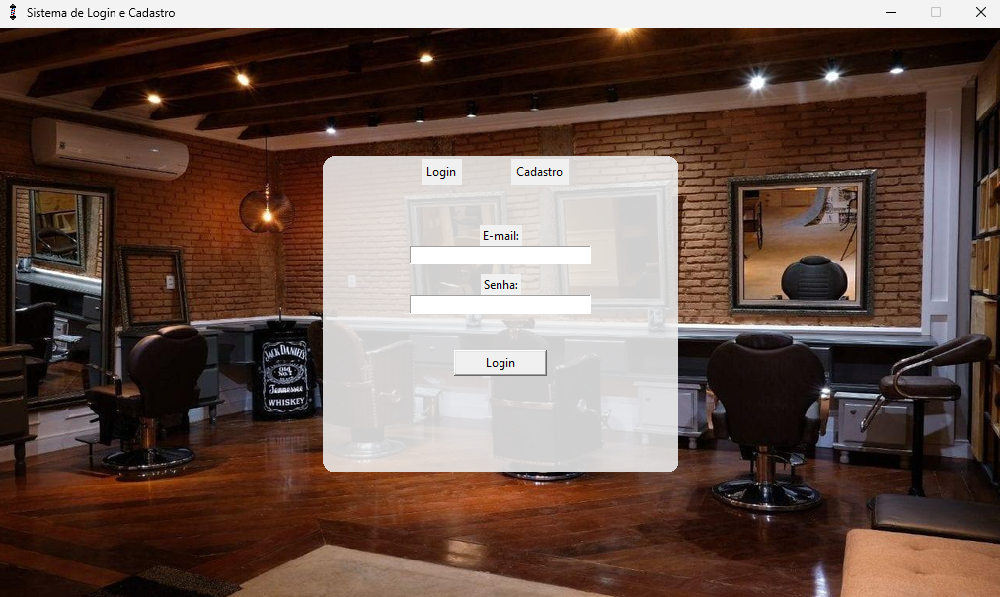
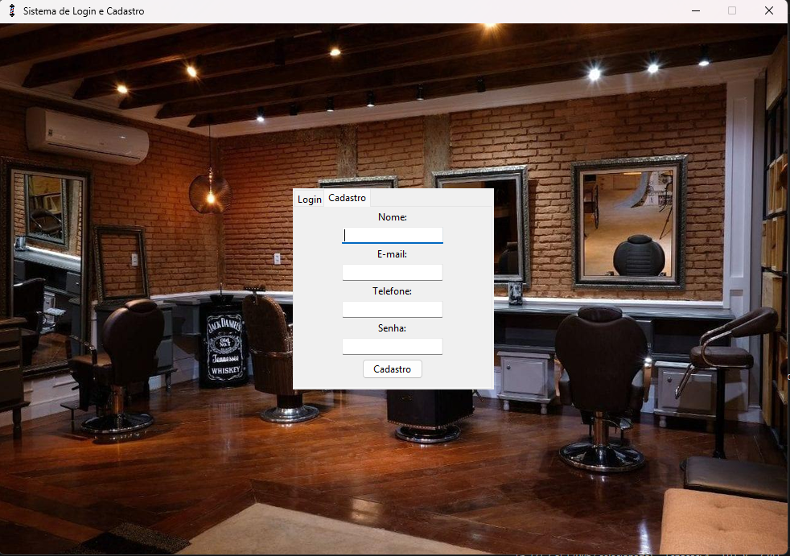
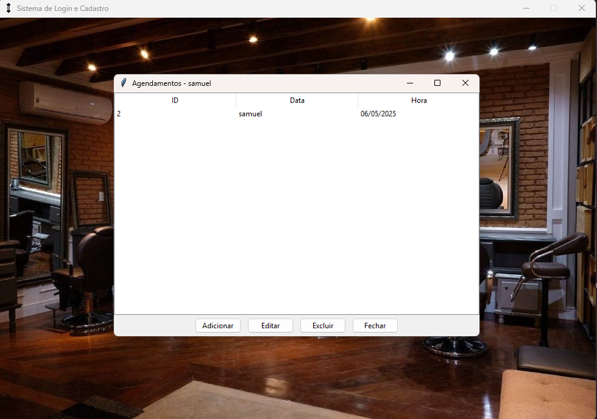

# Sistema_de_Login_e_Agendamento_para_Barbearia
Sistema simples em Python com Tkinter para gerenciamento de login, cadastro e agendamentos de uma barbearia. Permite que clientes se cadastrem, façam login e agendem horários. O dono da barbearia pode visualizar todos os agendamentos, enquanto os clientes só veem os seus próprios.

